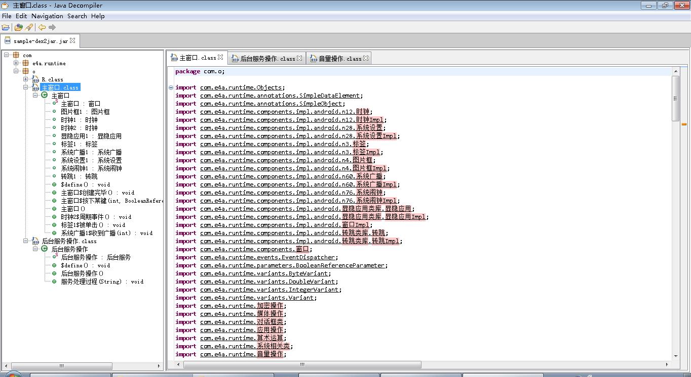

# 绪论

# 本论

那么于是简单地逆向了一下，发现

:sweat:居然没有混淆！

真开心。同时，由于这玩意没混淆，那么可以合情推理一下：

> 一般那些涉及XX的XX交易的恶意软件都是各种加壳混淆反逆向反XX的，

因此，看来这个APP只是个恶作剧APP而已。Naïve
 
不过，讲道理，这种大段大段往代码里塞中文的，总感觉在哪里见过:smirk:

当然你要说Swift支持用emoji写代码我也没意见:trollface:

既然看到了一个东西叫`runtime`，那么推测这个应该是某个运行时类库，希望这是公开的

还果然是
 
OK，让我脑补一下一个刚毕业的高中生用易语言写恶作剧应用的场景:doge:

既然现在情况慢慢明朗了起来，我们不如再看看第二个问题，那就是这玩意是咋工作的
 
看来这个“易安卓”框架也照搬了易语言里面的窗口的概念。那么我们再来看看`com.o.主窗口`里面是个啥东西
 
 
看得出来这里做了3件事情：

* 调大音量，播放XX音频
* 注册自定义广播“后台服务广播”
* 开启闹钟，每0.5秒给后台服务发送“闹钟”消息（这一点是翻“易安卓”的反编译结果+自己的瞎猜得到的:joy:此处省略100字）
那么后台服务收到“闹钟”消息之后做了啥呢
 
这个作者果然不是以一个好人的态度来写这个恶作剧的：每0.5秒开启一个无限循环，在每个无限循环里面不停地发送自定义广播“后台服务广播”

但是，这个作者还是需要学习一个：Android里面的每个服务默认只有一个主线程，那么在上面的“服务处理过程”函数执行完之前后面的“闹钟”消息是不会被响应的。因此，实际的效果是，只有一个无限循环，在这个无限循环里面不停地发送自定义广播“后台服务广播”:unamused:还是很恶劣的

收到“后台服务广播”之后，那么
 
调大音量，把APP窗口放到前台，并且屏幕解锁

PS：一开始我以为音量属于系统设置，那么我可以通过禁掉这个APP的修改系统设置的权限来避免它修改音量

