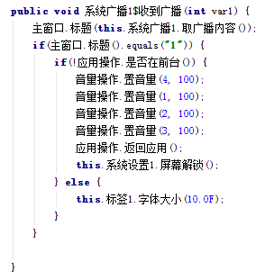

# 论自习室多起“不可描述声音”是如何产生的

## 绪论

16号晚上图书馆等自习室相继传来某不可告人的声音。据传这是某号称`QQ匿名聊天查看器`干的好事。从某群里面弄到安装包后自己在宿舍一个人测试了下：
* 启动后，可以退回主屏幕或手机其它界面，但不定期会回到APP的界面
* 可以调节音量，但立刻被调回最大值
* 过了一会，系统提示“QQ匿名聊天查看器已停止工作”，空气突然安静:doge:

## 本论

既然已经钦定了，那么于是简单地逆向了一下，发现

:sweat:居然没有混淆！

真开心。同时，由于这玩意没混淆，那么可以合情推理一下：

> 一般那些涉及XX的XX交易的恶意软件都是各种加壳混淆反逆向反XX的，

因此，看来这个APP只是个恶作剧APP而已。Naïve
 
不过，讲道理，这种大段大段往代码里塞中文的，总感觉在哪里见过:smirk:

当然你要说Swift支持用emoji写代码我也没意见:trollface:

既然看到了一个东西叫`runtime`，那么推测这个应该是某个运行时类库，希望这是公开的

还果然是

 
OK，让我脑补一下一个刚毕业的高中生用易语言写恶作剧应用的场景:doge:

既然现在情况慢慢明朗了起来，我们不如再看看第二个问题，那就是这玩意是咋工作的

看来这个`易安卓`框架也照搬了易语言里面的窗口的概念。那么我们再来看看`com.o.主窗口`里面是个啥东西

看得出来这里做了3件事情：

* 调大音量，播放XX音频
* 注册自定义广播`后台服务广播`
* 开启闹钟，每0.5秒给后台服务发送“闹钟”消息（这一点是翻`易安卓`的反编译结果+自己的瞎猜得到的:joy:此处省略100字）

那么后台服务收到`闹钟`消息之后做了啥呢
 

这个作者果然不是以一个好人的心态来写这个恶作剧的：每0.5秒开启一个无限循环，在每个无限循环里面不停地发送自定义广播`后台服务广播`

但是，这个作者还是需要学习一个：Android里面的每个服务默认只有一个主线程，那么在上面的`服务处理过程`函数执行完之前后面的`闹钟`消息是不会被响应的。因此，实际的效果是，只有一个无限循环，在这个无限循环里面不停地发送自定义广播`后台服务广播`:unamused:还是很恶劣的

收到`后台服务广播`之后，那么

 
调大音量，把APP窗口放到前台，并且屏幕解锁

PS：一开始我以为音量属于系统设置，那么我可以通过禁掉这个APP的修改系统设置的权限来避免它修改音量。然而修改音量用的是`android.media.AudioManager.html#setStreamVolume`，然而权限管理限制的是`android.provider.Settings.System`。毕竟还是图样啊

## 结论

* 这只是个简单的恶作剧软件，没有其它危害
* 但是这个软件通过滥用系统资源来达到目的
* ~~作者估计初学Android开发~~
* 很惭愧，只做了一些微小的贡献，谢谢大家

  
   
  To the extent possible under law,
  the person who associated CC0
  with this work has waived all copyright and related or neighboring
  rights to this work.

